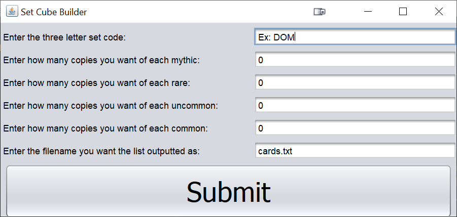

## About Jacob

### Summary

Jacob Franz is a skilled associate developer whose ability to collaborate with others,
persistence, and flexibility ensure that he can be an important part of any team. Jacob Franz
has a bachelor’s degree in Computer Science and Scientific Applications from Tennessee
Technological University. Jacob primarily used Java throughout college and extremely
comfortable writing in it. He has extensive experience both leading and working in teams from
both Nashville Event Lighting as a crew chief and in Boy Scouts where he obtained the rank of
Eagle Scout. Jacob enjoys the problem solving and cooperative nature of programming.
### Resume

[Resume](/pdf/polyglitch_resume.pdf)

## Portfolio

[Set-Cube-Builder](https://github.com/polyglitch/set-cube-builder)

[AI_Genetic_Algorithm](https://github.com/polyglitch/AI_Genetic_Algorithm)

---

### Category Name 2

- [Project 1 Title](http://example.com/)
- [Project 2 Title](http://example.com/)
- [Project 3 Title](http://example.com/)
- [Project 4 Title](http://example.com/)
- [Project 5 Title](http://example.com/)

---

---

Page template forked from <a href="https://github.com/evanca/quick-portfolio">evanca</a>

<!-- Remove above link if you don't want to attibute -->
